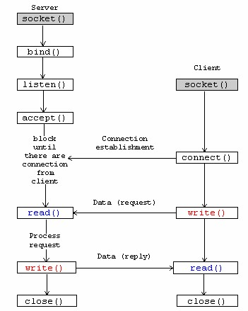

# NCKU-Linux-MiniProject2

## 題目：

- Server:
  - supports four commands:
    1. "add a b": return a+b
    2. "abs a": return |a|
    3. "mul a b": return a x b
    4. "kill"
    5. 若傳入的指令不是上述4個: return "Hello\n"
- Client:
  - reads the commands until EOF
  - sends the commands to server

- Test by yourself

```bash=
make clean && make all 
./server <port>
./client
```

## socket programming

:pencil2: [reference - socket programming](https://github.com/davidleitw/socket)

- **socket** 是一種 **IPC**(Inter-Process Communication) 的技術，用於兩個或多個 `process` 來進行資料交換或通訊。
- 在網路領域，**socket** 是著重於不同主機執行的 `process` 互相交換資料的通訊

### TCP Socket Programming



## Reference

- [socket programming](https://github.com/davidleitw/socket)
- [TCP Socket Programming](http://zake7749.github.io/2015/03/17/SocketProgramming/)
